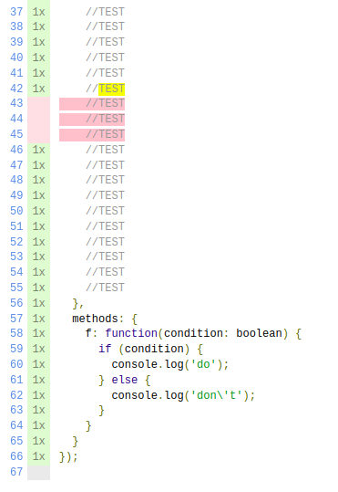
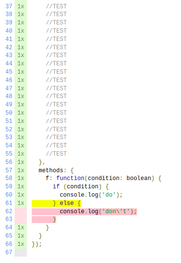

# Demo v8 Coverage Issues

This repository has been initialized to highlight issues about the **@vitest/coverage-v8** coverage provider.

This repository uses 
- Vue 3 (v3.3.4)
- TypeScript (v5.0.2)
- Vite (v4.4.0)
- Vitest (v0.33.0)
- @vitest/coverage-c8 (v0.33.0)
- @vitest/coverage-v8 (v0.33.0)

## Architecture

The component file `src/components/coverage-test-component.vue`, importing `src/components/coverage-test-component.ts`, is being tested from the `tests/coverage-test-component.spec.js` test file.

The `vite.config.ts` contains all coverage informations.

The following command is used to launch tests.
```console
$ npm run test:unit
```


## Observed results - V8

Using the V8 coverage provider in `vite.config.ts`, the following coverage is being observed.

```
 % Coverage report from v8
-------------------|---------|----------|---------|---------|-------------------
File               | % Stmts | % Branch | % Funcs | % Lines | Uncovered Line #s 
-------------------|---------|----------|---------|---------|-------------------
All files          |   95.45 |    83.33 |     100 |   95.45 |                   
 ...t-component.ts |   95.45 |    83.33 |     100 |   95.45 | 43-45             
-------------------|---------|----------|---------|---------|-------------------

=============================== Coverage summary ==============================
Statements   : 95.45% ( 63/66 )
Branches     : 83.33% ( 5/6 )
Functions    : 100% ( 3/3 )
Lines        : 95.45% ( 63/66 )
================================================================================
```


Prompting wrong lines not being covered, while lines actually not covered are flagged as correct.

`coverage/lcov-report/index.html` shows the following :



## Expected results - C8

Using the c8 coverage provider in `vite.config.ts`, the following coverage is being observed.


```
% Coverage report from c8
-------------------|---------|----------|---------|---------|-------------------
File               | % Stmts | % Branch | % Funcs | % Lines | Uncovered Line #s 
-------------------|---------|----------|---------|---------|-------------------
All files          |   96.96 |       75 |     100 |   96.96 |                   
 ...t-component.ts |   96.96 |       75 |     100 |   96.96 | 62-63             
-------------------|---------|----------|---------|---------|-------------------

=============================== Coverage summary ===============================
Statements   : 96.96% ( 64/66 )
Branches     : 75% ( 3/4 )
Functions    : 100% ( 3/3 )
Lines        : 96.96% ( 64/66 )
================================================================================
```

Lines not covered are displayed correctly.

`coverage/lcov-report/index.html` shows the following :


